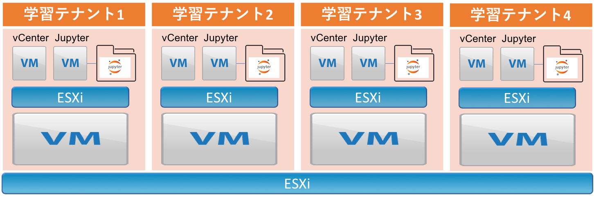

# ansible-vmware-learning-materials

VMwareを使ってAnsibleを学習するための環境を準備するPlaybookや教材がまとまったリポジトリです。

> 現状はベースESXi上にネストするSXiとvCenterをデプロイするところまでしかできません。

## 目的



ハイパーバイザー(ESXi)をネストして学習用の環境を構築します。  
ベースとなるESXiホストを準備し、その上に自動で学習テナントを構築します。  
イメージは上図のようにマルチテナントで専用学習環境を準備します。  
学習対象者は[Jupyter](http://jupyter.org/)と[Ansible Jupyter Kernel](https://github.com/ansible/ansible-jupyter-kernel)を使ってAnsibleを操作することを想定しています。

## デプロイ必要条件

* Ansible >= 2.6
* python >= 2.6(Python3は未サポート)
* pyvmomi
* xmltodict

## テストした環境

|    項目   |     バージョン     |
|-----------|--------------------|
| Ansible   | 2.6.2              |
| vSphere   | 6.5, 6.7           |
| python    | 2.7.5              |
| pyvmomi   | 6.5.0.2017.5.post1 |
| xmltodict | 0.11.0             |

## 準備

学習環境を環境をデプロイするには以下が必要です。

* ansible-vmware-learning-materials
* Ansibleと必要なpythonモジュール
* ベースとなるESXiホスト
* vCenter Server Appliance(VCSA)
* ネストするESXiのOVFファイル
* Jupyter環境を構築するLinux OVFファイル
* DNSサーバ

### ansible-vmware-learning-materialsのクローン

デプロイ作業をするホストに本リポジトリをクローンしてください。

```
$ git clone https://github.com/sky-joker/ansible-vmware-learning-materials.git
```

### Ansibleと必要なpythonモジュールのインストール

デプロイ作業をするホストにAnsibleをインストールします。

```
# yum install ansible
```

または

```
# pip install ansible
```

必要なpythonモジュールのインストールは以下の手順です。

```
# pip install -r requirements.txt
```

### ESXiとVCSAのダウンロード

VMwareの無償評価版をダウンロードできるページへアクセスしESXiとVCSAのをダウンロードしてください。

[https://www.vmware.com/jp/try-vmware.html](https://www.vmware.com/jp/try-vmware.html)

### ベースESXiについて

ベースとなるESXiホストを構築してください。

### vCenter Server Applianceについて

ダウンロードしたVCSAアーカイブを解凍した中身を `deploy_files/vcenter/` 配下へコピーします。  
以下のようなパスにします。

```
$ tree -L 1 deploy_files/vcenter
deploy_files/vcenter
├── dbschema
├── embedded_vCSA_on_ESXi.json
├── migration-assistant
├── readme-de.txt
├── readme-es.txt
├── readme-fr.txt
├── readme-ja.txt
├── readme-ko.txt
├── readme-zh-CN.txt
├── readme-zh-TW.txt
├── readme.txt
├── umds
├── vcsa
├── vcsa-cli-installer
└── vcsa-ui-installer
```

### OVFファイルについて

予めESXi上にベースとなるESXiのVMとLinuxのVM(現状はCentOS7のみサポート)を作成しOVFとしてダウンロードしておく必要があります。  
作成したOVFは `deploy_files/esxi_ovf/` `deploy_files/linux_ovf/` に保存します。  
`ovf_download.yml` を使うことで上記で指定したパスにOVFを自動で保存することができます。  
`ovf_download.yml` を使うには以下のように修正します。

```yaml
---
- name: Download of VMware VM OVF.
  hosts: localhost
  gather_facts: no
  vars:
    # ESXi or vCenter Hostname or IP.
    hostname: 192.168.0.1
    # ESXi or vCenter login username.
    username: root
    # ESXi or vCenter login password.
    password: secret
    # Specify ESXi VM name to download.
    target_esxi_vm_name: esxi-6.5
    # Specify Linux VM name to download.
    target_linux_vm_name: centosvm
(snip)
```

`ovf_download.yml` を修正後実行します。

```
$ ansible-playbook ovf_download.yml
```

### DNSサーバ

VCSAをデプロイする時に設定するDNSサーバを構築してください。

## 学習環境のデプロイ

### inventory説明

学習環境をデプロイするには `invneotry` ファイルを修正する必要がります。  
以下は、inventoryファイルの説明です。

|                項目               |                                   説明                                  |
|-----------------------------------|-------------------------------------------------------------------------|
| esxi_host                         | ベースESXiのIP又はホスト名                                              |
| esxi_username                     | ベースESXiにログインするユーザー名                                      |
| esxi_password                     | ベースESXiにログインするパスワード                                      |
| esxi_ovf_path                     | ESXi OVFが保存されているディレクトリパス                                |
| esxi_vm_name                      | デプロイするESXi VMの名前                                               |
| esxi_cpu_core                     | デプロイするESXiのCPUコア数                                             |
| esxi_cpu_socket                   | デプロイするESXiのCPUソケット数                                         |
| esxi_memory_mb                    | デプロイするESXiのメモリ容量(MB)                                        |
| esxi_deployment_networks          | デプロイするESXiが所属するPortGroup(dict型)                             |
| esxi_deployment_datastore         | デプロイするESXiを保存するデータストア名                                |
| esxi_guest_os_username            | デプロイするESXiのOSユーザー名(OVF作成時に設定したものを指定)           |
| esxi_guest_os_password            | デプロイするESXiのOSパスワード(OVF作成時に設定したものを指定)           |
| esxi_guest_ip                     | デプロイするESXiに設定するVMKernel IP                                   |
| esxi_guest_netmask                | デプロイするESXiに設定するVMKernel IPのネットマスク                     |
| esxi_guest_gateway                | デプロイするESXiに設定するデフォルトゲートウェイ                        |
| vcenter_deploy_cmd_dir            | vCenterをデプロイするためのcliコマンドが保存されているディレクトリパス  |
| vcenter_deployment_network_name   | デプロイするvCenterが所属するPortGroup                                  |
| vcenter_deployment_datastore_name | デプロイするvCenterが保存されるデータストア名                           |
| vcenter_thin_disk_mode            | デプロイするvCenterをthinでデプロイするかのモード                       |
| vcenter_size                      | デプロイするvCenterのサイズ                                             |
| vcenter_vm_name                   | デプロイするvCenterのVM名                                               |
| vcenter_os_username               | デプロイするvCenterのOSユーザー名                                       |
| vcenter_os_password               | デプロイするvCenterに設定するOSパスワード                               |
| vcenter_ip_family                 | デプロイするvCenterのIPアドレスファミリー                               |
| vcenter_ip_mode                   | デプロイするvCenterのIPモード                                           |
| vcenter_ip                        | デプロイするvCenterに設定するIPアドレス                                 |
| vcenter_prefix                    | デプロイするvCenterに設定するプレフィックス                             |
| vcenter_dns_servers               | デプロイするvCenterに設定するDNSサーバ                                  |
| vcenter_gateway                   | デプロイするvCenterに設定するゲートウェイ                               |
| vcenter_hostname                  | デプロイするvCenterに設定するホスト名(IP or FQDN)                       |
| vcenter_ntp_servers               | デプロイするvCenterに設定するNTPサーバ(無い場合はNullを指定)            |
| vcenter_ssh_enable                | デプロイするvCenterのSSHサービス状態                                    |
| psc_sso_password                  | SSOで使用する管理者パスワード                                           |
| psc_sso_domain_name               | SSOで使用するドメイン                                                   |
| vcenter_ceip_enabled              | [CEIP](https://www.vmware.com/jp/solutions/trustvmware/ceip.html)の状態 |
| datacenter_name                   | デプロイしたvCenterに作成するデータセンター名                           |

**注意点**

vCenterのホスト名にFQDNを指定する場合は、設定したDNSサーバからFQDNの名前解決できることが必須です。  
もし名前解決できない場合はIPアドレスを指定してください。

### デプロイ手順

OVFとvCenterファイルが存在するか確認します。(以下は例です)

```
$ ls deploy_files/esxi_ovf/
disk-0.vmdk  esxi-6.5.ovf
$ ls deploy_files/linux_ovf/
centosvm.ovf  disk-0.vmdk
$ ls deploy_files/vcenter/
dbschema                    migration-assistant  readme-es.txt  readme-ja.txt  readme-zh-CN.txt  readme.txt  vcsa                vcsa-ui-installer
embedded_vCSA_on_ESXi.json  readme-de.txt        readme-fr.txt  readme-ko.txt  readme-zh-TW.txt  umds        vcsa-cli-installer
```

`inventory` ファイル修正後に以下のコマンドを実行します。

```
$ ansible-playbook install.yml -i invnetory
```

1回につき1学習テナントのデプロイが可能です。
